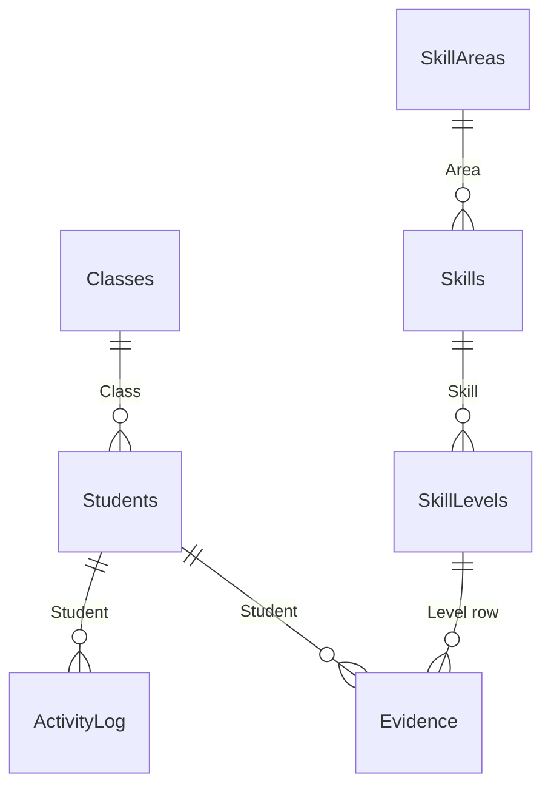

# Coda Document Indexer

## Purpose

When working with a Coda document via MCP, Claude typically needs many API calls just
to understand the document structure before doing any real work. This skill front-loads
that discovery into a single indexing step, writing the results to a page called
`CLAUDE.md` inside the document — analogous to how `CLAUDE.md` works in code
repositories. On future visits, one `page_read` call gives Claude everything it needs.

## Commands

```
/coda-mcp-init <doc_url_or_uri>   Full crawl → create/update CLAUDE.md page
/coda-mcp-init check              Quick diff: compare document_read against stored index
/coda-mcp-init read               Just read the existing CLAUDE.md page
```

If no command is given but the skill triggers (e.g. user pastes a Coda URL and asks
to work with it), do `/coda-mcp-init read` first. If the page doesn't exist, do
`/coda-mcp-init`.

## Workflow: Full Index (`/coda-mcp-init`)

### Step 1: Resolve the document

The user may provide the document in several forms:

- **Web URL** (e.g. `https://coda.io/d/_dBl2dHKdHKB`): use `Coda:url_convert`
  (action: decode, scope: document) to get the `coda://docs/{docId}` URI.
- **Doc ID** (e.g. `Bl2dHKdHKB`): construct `coda://docs/{docId}` directly.
- **Document name** (e.g. "Worklog"): use `Coda:search` with the name as query.
  ALWAYS confirm with the user before proceeding — show: full document title,
  owner, last edited (date/time and by whom), and web URL. If search returns
  multiple candidates, list them all so the user can pick. Indexing the wrong
  doc is cheap, but working with the wrong doc's data is dangerous.
- **Nothing specified**: if context makes it clear which doc (e.g. ongoing
  conversation), use that. Otherwise ask.

### Step 2: Crawl the document structure

**Important:** `document_read` returns the page tree but does NOT return tables.
Tables must be discovered by calling `page_read` on individual pages.

1. **`Coda:document_read`** with `contentTypesToInclude: ["tables", "formulas", "controls"]`
   and `pageLimit: 50`.
   - Returns: page tree (with hierarchy), but typically 0 tables/formulas/controls
     at the document level.
   - Save the full page tree — you need it to know which pages to crawl.

2. **Identify pages likely to contain tables.** Look at the page tree for:
   - Pages named after data concepts (Tables, Records, Log, Items, etc.)
   - Pages deep in the tree under "Backend", "Data", "Admin" sections
   - Leaf pages (no children) under organizational pages
   - Skip obvious non-data pages (templates, guides, "how to" pages)

3. **For each candidate page**, call **`Coda:page_read`** with
   `contentTypesToInclude: ["tables"]`.
   - This returns full table schemas including columns, formulas, lookups, and views.
   - Each call may return 0-3+ tables.

4. **Build the relationship graph**: from lookup columns (`format.type == "lookup"`),
   construct table-to-table relationships using `format.objectId` (target table ID).

### Step 3: Generate the index content

Structure the CLAUDE.md page content as follows:

```markdown
# CLAUDE.md

> Auto-generated by Claude. Last indexed: {ISO date}
> Document: {doc title} | URI: coda://docs/{docId}
> Web URL: {web URL}

## Purpose
{1-3 sentence AI-generated summary of what this document does,
based on page names, table names, and column structure}

## User notes
{This section is for the document owner. Add context Claude should know
when working with this document — business rules, naming conventions,
which tables matter most, what NOT to touch, etc.
Feel free to edit anything on this page.}

## Key Pages
| Page | URI | Parent | Notes |
|------|-----|--------|-------|
(list only structurally important pages, not all 40+)

## Tables
### {Table Name}
- **URI:** tables/{tableId}
- **On page:** {page title}
- **Rows:** {rowCount}
- **Purpose:** {AI-inferred — users: feel free to correct this}
- **Key columns:**
  | Column | ID | Type | Formula | Lookup → |
  (include only important columns — skip infrastructure like sync cols)

## Relationships (Mermaid ER diagram)

Generate a Mermaid erDiagram from the discovered lookup relationships.
Output as a codeblock with language tag `mermaid`. Example:



Use table names as entities, column names as relationship labels.
Users can render this in Coda using the Mermaid Pack
(https://coda.io/packs/mermaid-10537) or paste it into any
Mermaid-compatible renderer.

## Notes for Claude
(technical quirks discovered during crawl — e.g. "document_read doesn't
return tables", "boolWorthy is a global teacher-identity gate", etc.)
```

### Step 4: Write the index page

1. **Check if `CLAUDE.md` already exists**: scan the page list from Step 2.
   - If it exists: use `content_modify` to update.
   - If it doesn't exist: use `page_create` with title `CLAUDE.md`.

2. **Write the content** using `content_modify` with `insert_element` operations
   (blockType: "markdown"). Split into multiple operations — each block has a
   10,000 character limit. 4-5 blocks is typical.

3. **Confirm to the user**: report what was indexed (N pages, M tables,
   K relationships, total API calls used) and include a direct link to the
   CLAUDE.md page (web URL). If locking was involved, remind the user to
   re-lock the page — again with a direct link.

### Step 5: Page locking

**Coda page locking IS enforced server-side for `content_modify`.** The
official documentation claims locking is client-side only — this is incorrect
for MCP write operations on page content.

Behavior:
- `page_create` succeeds even with doc-wide locking enabled.
- `content_modify` FAILS on locked pages with:
  `Cannot perform canvasTextModify on canvas '...' has restricted permissions
  (protection mode 'DEFAULT')`
- It is NOT necessary to disable locking doc-wide. The user only needs to
  unlock the specific CLAUDE.md page.

**Workflow when locking is encountered:**

1. Attempt `content_modify`. If it fails with "restricted permissions":
2. Construct the direct URL to the page (from `page_create` response or
   `url_convert`). Tell the user:
   "The CLAUDE.md page is locked. Please unlock it: open [link to page] →
   page options (⋯) → Locking → unlock this page. Let me know when done."
3. Wait for confirmation, then retry.
4. After successful write, remind the user: "You may want to re-lock the
   CLAUDE.md page now: [link to page] → page options → Locking."
5. If the user can't or won't unlock: output the index content as a code
   block in the conversation so they can paste it manually.

## Workflow: Quick Check (`/coda-mcp-init check`)

1. `document_read` on the doc (page list only).
2. `page_read` on the `CLAUDE.md` page — extract the page/table lists.
3. Compare: any new/removed pages? If yes, suggest re-index.
4. If unchanged, report "Index is current."

## Workflow: Read (`/coda-mcp-init read`)

1. Find `CLAUDE.md` in the page list (via `document_read`).
2. `page_read` with `contentTypesToInclude: ["markdown"]`.
3. Use the content as context for the rest of the conversation.
4. If not found, tell the user and suggest `/coda-mcp-init`.

## When to auto-trigger

If the user pastes a Coda URL or asks to work with a Coda document:
1. Try `/coda-mcp-init read` first (2 calls).
2. If `CLAUDE.md` doesn't exist, ask: "This doc doesn't have a CLAUDE.md yet.
   Want me to create one? It'll cost ~15 API calls but saves time on every
   future interaction."
3. If the user declines, fall back to normal discovery.

## Token economics (measured on a real 42-page document)

**Without index (per conversation):**
- document_read: 1 call (pages only, no tables!)
- page_read × N pages to find tables: ~6-10 calls
- Possible retries and searches: 2-3 calls
- **Total: ~10-15 calls every time**

**Building the index (one-time):**
- url_convert: 1
- document_read: 1
- page_read × data pages: ~6 (depends on doc structure)
- page_create: 1
- content_modify × blocks: ~4-5
- **Total: ~14-16 calls once**

**Reading the index (every subsequent conversation):**
- document_read: 1 (find CLAUDE.md page URI)
- page_read: 1
- **Total: 2 calls**

**Break-even: 2nd conversation.**

## Important notes

- The `CLAUDE.md` page is for Claude's orientation AND for users to annotate.
  Users are encouraged to edit it — especially "User notes", "Purpose", and
  table purpose descriptions. Anything the user thinks Claude should know
  belongs here.
- Column IDs and table IDs are stable in Coda — they survive renames.
  The index remains valid after cosmetic changes.
- Structural changes (adding/removing tables or columns) invalidate the index.
  Use `/coda-mcp-init check` to detect this.
- The index stores only schema, not row data. It's not a backup.
- **Synced tables**: detect by table URI pattern `grid-sync-*` (the number
  after `sync-` is the pack ID, e.g. 1054 = Coda Doc Sync).
  Infrastructure columns from sync: `value` (Row),
  `synced` (Synced), `connection` (Sync account), `Row url` — omit from index.
  To find the **source document and table**, read a few rows with
  `table_rows_read` and extract the URL from the `Row url` column — it
  contains the source doc ID and table ID. Record this in the index so
  future sessions can navigate directly to the source.
  Distinguish synced columns (come from the source) from locally-added
  columns (exist only in this doc) — the latter are the ones with formulas,
  lookups, buttons, and doc-specific data.
- For very large documents (50+ tables), crawl only the pages the user
  identifies as important, or do it in batches.

## Reference

- **Coda API/MCP docs**: https://coda.io/developers
